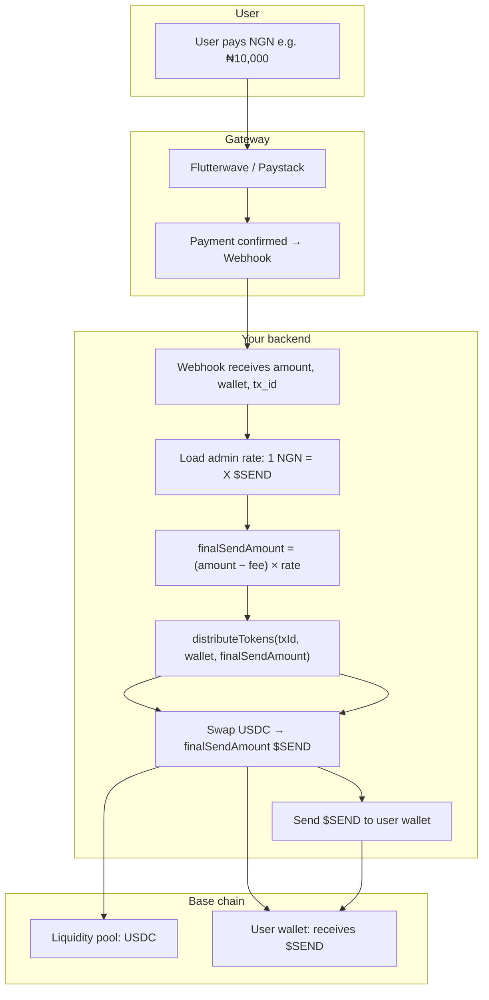

# How $SEND Token Distribution Works

This document explains how a user’s NGN payment becomes $SEND in their wallet. The **admin “price exchange”** (1 NGN = X $SEND) is the single source of truth for how much $SEND the user receives.

---

## High-level flow

1. **User pays NGN** (e.g. via Flutterwave or Paystack).
2. **Webhook** receives the payment and uses the **admin exchange rate** to compute the **equivalent $SEND** the user paid for.
3. **Backend** swaps **USDC → that amount of $SEND** (Paraswap/Aerodrome on Base).
4. **Backend** sends that $SEND from the liquidity pool wallet to the user’s wallet.

So: **NGN payment → equivalent $SEND (admin rate) → swap USDC for that $SEND → send $SEND to user.**

---

## Diagram

```
┌─────────────────────────────────────────────────────────────────────────────────┐
│                         USER PAYS NGN                                            │
└─────────────────────────────────────────────────────────────────────────────────┘
                                        │
                                        ▼
┌─────────────────────────────────────────────────────────────────────────────────┐
│  PAYMENT GATEWAY (Flutterwave / Paystack)                                         │
│  • User pays ₦X (e.g. ₦10,000)                                                    │
│  • Gateway confirms payment → sends webhook to your API                            │
└─────────────────────────────────────────────────────────────────────────────────┘
                                        │
                                        ▼
┌─────────────────────────────────────────────────────────────────────────────────┐
│  WEBHOOK (e.g. /api/flutterwave/webhook or /api/paystack/webhook)                 │
│  • Receives: amount (NGN), transaction_id, wallet_address, user id              │
│  • Loads admin “price exchange”: 1 NGN = 0.01823 $SEND (from platform_settings)   │
│  • Computes fee (NGN), then:                                                       │
│      finalSendAmount = (amount - feeNGN) × exchangeRate                           │
│    → “Equivalent $SEND user paid for” (e.g. 182.3 $SEND)                          │
│  • Calls distributeTokens(transactionId, walletAddress, finalSendAmount)          │
└─────────────────────────────────────────────────────────────────────────────────┘
                                        │
                                        ▼
┌─────────────────────────────────────────────────────────────────────────────────┐
│  TOKEN DISTRIBUTION (lib/token-distribution.ts)                                   │
│  • Receives finalSendAmount = equivalent $SEND from admin rate                    │
│  • Swaps USDC → that much $SEND (Paraswap / Aerodrome on Base)                    │
│    → Liquidity pool holds USDC; we “buy” finalSendAmount $SEND with USDC          │
│  • Sends that $SEND from pool wallet to user’s wallet (Base)                       │
│  • If swap fails → fallback: send $SEND from pool’s small $SEND balance (if any)  │
└─────────────────────────────────────────────────────────────────────────────────┘
                                        │
                                        ▼
┌─────────────────────────────────────────────────────────────────────────────────┐
│  USER'S WALLET (Base)                                                             │
│  • Receives exactly finalSendAmount $SEND                                         │
│  • Same amount the UI showed: “Amount of $SEND” from “Rate: 1 NGN = X $SEND”      │
└─────────────────────────────────────────────────────────────────────────────────┘
```

---

## Mermaid flowchart (for GitHub / doc viewers that support Mermaid)



---

## Where each part lives

| Step | Where it happens |
|------|------------------|
| Admin “price exchange” | Admin dashboard → **platform_settings** (e.g. 1 NGN = 0.01823 $SEND). Loaded via `getExchangeRate()` in `lib/settings.ts`. |
| “Equivalent $SEND” | `calculateFinalTokens(amount, feeNGN, exchangeRate)` in `lib/fee-calculation.ts` → **finalSendAmount**. |
| Webhook calls distribution | Flutterwave: `app/api/flutterwave/webhook/route.ts`. Paystack: `app/api/paystack/webhook/route.ts`. Both call `distributeTokens(transactionId, walletAddress, finalSendAmount)`. |
| Swap USDC → $SEND | `swapUsdcToSend(sendAmount)` in `lib/base-onramp-swap.ts` (Paraswap/Aerodrome on Base). |
| Send $SEND to user | `transferTokens(recipient, amountToSend)` in `lib/blockchain.ts` (from liquidity pool wallet to user). |

---

## Example with numbers

| Item | Value |
|------|--------|
| User pays | ₦10,000 |
| Admin rate | 1 NGN = 0.01823 $SEND |
| Fee (NGN) | e.g. ₦500 |
| NGN after fee | ₦9,500 |
| **Equivalent $SEND** | 9,500 × 0.01823 = **173.185 $SEND** |
| What backend does | Swap USDC for **173.185 $SEND**, then send **173.185 $SEND** to user’s wallet |

So the user gets exactly the “Amount of $SEND” implied by the admin “price exchange” and the NGN they paid.
